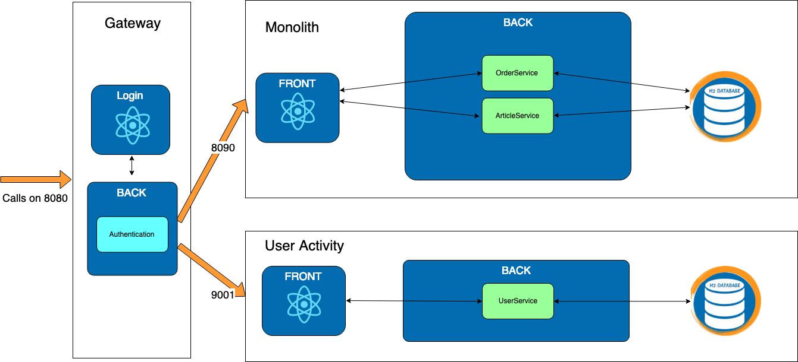

# Exercise 2 : Gateway

Previously on HOMicS -> [Exercise 1: User Activity](../user-guide/user-activity.md)

## Context

In the previous schema, you might realize that there is a flaw. We don't have any authentication for the micro-service.

 What happens if you connect directly to the user-activity microservice ?

You can go directly to [user-activity](http://localhost:9001/user/userActivity). The login page is skipped and the data
is accessible! Oopsy, not great at all.

We could duplicate all the security code in the new microservice. But imagine if we have twenty microservices, it's going
to be a mess if we need to add the security in each of them. The services won't be loosely coupled. It's where the
gateway becomes handy.

A gateway is a service that provides a single-entry point for certain groups of microservices. Any requests to our
application will go through the gateway and it will be routing to our different services.

## Goal 

Create the **Gateway** microservice responsible for all authentication and redirection. It's going to handle the
authentication and redirect to the **monolith** or the **user-activity** microservice.

Everything has been implemented in other microservices. You only need to edit the gateway.

## At your keyboard

Checkout the branch: 
        
    git checkout exercise-2
        
There is a new folder for the gateway microservice. You are not going to start from scratch but you will need
to implement some part of it.

Start the gateway and the two other services:

    # gateway
    mvn spring-boot:run -pl gateway
    # monolith
    mvn spring-boot:run -pl monolith
    # user-activity
    mvn spring-boot:run -pl user-activity
    
Navigate on the different pages and you realize that all pages return a 404. There is no routing in our application.

### 2 - Gateway 

#### _TODO_ 2.1: Application.yaml

There won't be any database for the gateway since it's not holding any data. It's going to be running on port 8080.

We are using [ZUUL](https://github.com/Netflix/zuul) developed by Netflix that is an edge service that provides dynamic
routing, monitoring, resiliency, security, and more. Spring integrated it in **Spring Cloud**.

You will need to set it up in your `application.yaml`.

 zuul documentation is available [here](https://cloud.spring.io/spring-cloud-netflix/multi/multi__router_and_filter_zuul.html)

To help you with the configuration in your yml file, here is an example:

    zuul:
      routes:
        testservice:
          path: /test/**
          url: http://example.com/test/

------

#### _TODO_ 2.2: Enable Zuul

Checkout the second _TODO_ to enable the Zuul Routing.

**Checklist** :
    
1. Since the routing is done and should be working, start your three apps if they aren't already up:
    
        # gateway
        mvn spring-boot:run -pl gateway
        # monolith
        mvn spring-boot:run -pl monolith
        # user-activity
        mvn spring-boot:run -pl user-activity
       
2. Verify that if you log in, you see your articles and all the pages under the same port: 8080.

 What happens if you try to pay for a cart? 

It doesn't work because the monolith doesn't know your user. Let's add it to our context in the next step.

------

#### _TODO_ 2.3: Logged user information

Last but not least, you need to add the logged user to the headers so all micro services will be able to retrieve the
connected user.

Open `AddUserFilter` and implement the `run` method so it adds the username into the request context.

**Checklist** :
        
1. To verify that gateway is well implemented, launch all the applications:
   
        # Run monolith project
        mvn spring-boot:run -pl monolith
       
        # Run user-activity project
        mvn spring-boot:run -pl user-activity
       
        # Run Gateway project
        mvn spring-boot:run -pl gateway
   
2. Access the [HOMicS MarketPlace](http://localhost:8080/login). You should be on the gateway. After logging, you should be
directly redirect to the monolith and you can notify that the port is still 8080. You should be able to access as well
the user-activity microservice on the _User Activity micro_ tab.

 Since the **Gateway** is running on port 8080, the port for the monolith has been changed to 8090. 

## List of _TODOs_

2.1 - file application.yaml for gateway

2.2 - file com.homics.gateway.GatewayApplication

2.3 - file com.homics.gateway.config.filter.AddUserFilter

## Monolith database

You can access the **monolith** database console via the following [url](http://localhost:8090/console).

## Results

 You can still access the other services directly on each port 8090 and 9001.
In practice, you will block those ports from the outside via a firewall.

Well done. Let's continue on to the next step and our new microservices.

## What's next ? [Exercise 3: Stats](../user-guide/stats.md)
