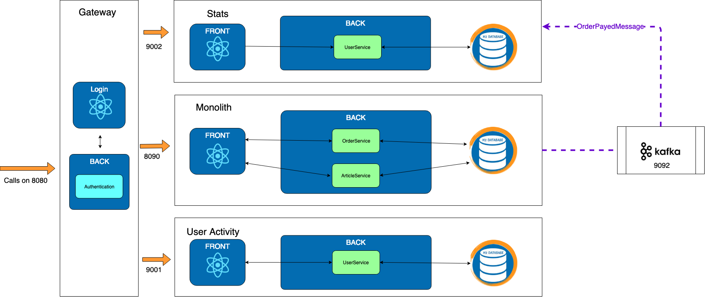

# Exercise 4 : Stats with Kafka

Previously on HOMicS -> [Exercise 3: Stats](stats.md)

## Context

>  Do you remember what we said at the beginning about getting the monolith thinner?

The previous solution has a considerable drawback. We had to add logic in the monolith and it's not really scalable. 

## A word on KAFKA

[Apache Kafka](https://kafka.apache.org/) is an event streaming platform capable of handling trillions of events a day.

Initially conceived as a messaging queue by LinkedIn, Kafka is based on an abstraction of a distributed commit log.

The main advantages of kafka are :

- High-throughput
- Low Latency
- Fault-Tolerant
- Scalability
- Distributed

Keep in mind, adding kafka comes with a cost. It's a library with a learning curve and advance concepts.  

>  We are using Kafka to produce, consume and store messages.

## Goal 

We will change what was done in exercise 3, but this time using kafka. No need for table and crawler anymore.

When an order is payed, an event is sent.
 
Kafka stores it until a consumer reads it.
 
It's very convenient: our monolith doesn't have to battle with acknowledgment anymore.

It's the stats microservice which consumes the message.



## At your keyboard

Checkout the branch: 
        
    git checkout exercise-4

This exercise is split in two parts.

1. You will edit the **Monolith** to send a message to kafka when an order is payed.

2. You will consume the messages in the **Stats** microservice.

## Setup

1. Before implementing anything, for this exercise, we need to have a running instance of kafka. The easiest way is to launch
it via docker. We can then easily restart or reset it. You will find a docker-compose file already present.

    So first of all, download docker and start docker. Go back to the [Setup](../setup.md) page if needed.

    We are using Spring for Apache Kafka. All the configuration for serializing, topic creation is done in the 
    common-messaging lib. If you want to check it out, go on github in the HOMicS project.

2. Run kafka
    
    In `/tools/docker/kafka/`, the docker-compose file will launch an instance of **zookeeper** and **kafka**.
    To start kafka simply run :

        cd commons-messaging
        docker-compose up
    
    To stop 
    
        cd commons-messaging
        docker-compose stop

### 4.1 - Monolith

**[todo 1]** - Send a kafka message

Switch the API calls in the monolith to send an OrderPayedMessages message to kafka.

To send a message with kafka :

```
private KafkaTemplate<String, OrderPayedMessage> kafkaTemplate;

Message<OrderPayedMessage> message = MessageBuilder
                .withPayload(new OrderPayedMessage(1,1,"user"))
                .setHeader(KafkaHeaders.TOPIC, TOPIC_STATS)
                .build();

kafkaTemplate.send(message);
```

**Checklist** 

1. Verify that you sent a kafka message

    You can verify the creation of your message by creating a consumer via command line on your docker. To do so, you need
    to run the following command:

        docker exec $(docker ps | awk '$2 == "wurstmeister/kafka:1.0.0"' | awk '{print $1}') kafka-console-consumer.sh --bootstrap-server localhost:9092 --topic STATS --from-beginning

    You should see the previous carts you payed.  

### 4.2 - Stats

**[todo 2]** - In the microservice, retrieve the message with kafka :

```
@KafkaListener(topics = TOPIC_STATS, groupId = GROUP_ID, containerFactory = STATS_MESSAGE_FACTORY)
public void onStatsMessage(@Payload OrderPayedMessage impactStockMessage) {
        ...
}
```

**[todo 3]** - Save this message into the database.

## List of _TODOs_

| **Todo** | **File(s)**                           |
|----------|---------------------------------------|
| 1 | com.homics.monolith.service.StatsService |
| 2 | com.homics.stats.service.OrderStatsService |
| 3 | com.homics.stats.service.OrderStatsService |

## Verification and results

To verify that **stats** is well implemented, launch the gateway, and the monolith applications:

```bash
# Run gateway project
mvn spring-boot:run -pl gateway

# Run monolith project
mvn spring-boot:run -pl monolith
```

Login to the application on the [login page](http://localhost:8080/login). Create two carts and pay for them.

You see a 404 page on the _Stats Micro_ tab. The **stats** microservice isn't up and running at that point. This behaviour
makes sense.

Now, start the microservice **Stats**:

````bash
# Run stats project
mvn spring-boot:run -pl stats
````

Navigate to the _Stats Micro_ tab. You should see the same page than before with the stats from the previous two orders.
All the stats should be retrieved. If you don't see them, refresh few times to let the monolith discuss with the microservice .

It's exactly the same actions than exercise 3.


## What's next ? [Exercise 5: Stock](stock.md)
