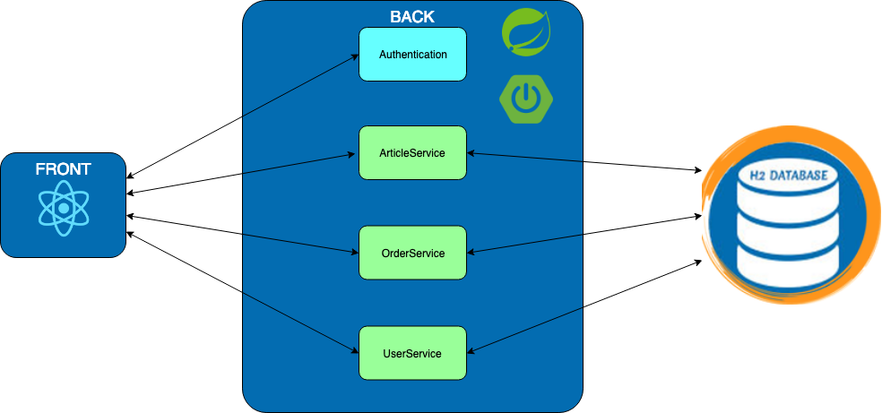

# Exercise 0 : The Monolith

## Fruit Market Place

Our application is a fruit market place. You can select any items from a list of ten fruits and put them in your cart.
You can access your cart and pay for your order. Some stats are computed to let you know what is the average prize of 
your cart. We implemented a tracking service for your user: we are saving the login and logout action of any users.

## Architecture

The monolith is pretty simple. We want to avoid any confusion with a complicated application. The schema below explains
the monolith architecture and what composed it.

The application is using **SpringBoot** with **Spring Data JPA** and **Spring Security** for the back. The database is 
a **h2** and the front is implemented in **React**.

You won't need to interact with the front. It's already implemented for each exercise in this HandsOn. You will only play
with the back.

## Steps:

1. Start the monolith

    To run your monolith, clone the repository via the following command:
    
        git clone https://github.com/homics/handson.git
        
    Start your application via IDE (`MonolithApplication.java`), or with this command line:
    
        mvn spring-boot:run -pl monolith

2. Access the application
    
    Go to [localhost:8080](http://localhost:8080) and log with _admin/admin_. You should be able to navigate on the
    application:
    
    
    
    To access the `h2` console, after logging as admin, go to :
    [localhost:8080/console](http://localhost:8080/console) and use the credentials: _admin/admin_.
    
    
    
## What's next ? [Exercise 1: User Activity](user-activity.md)
