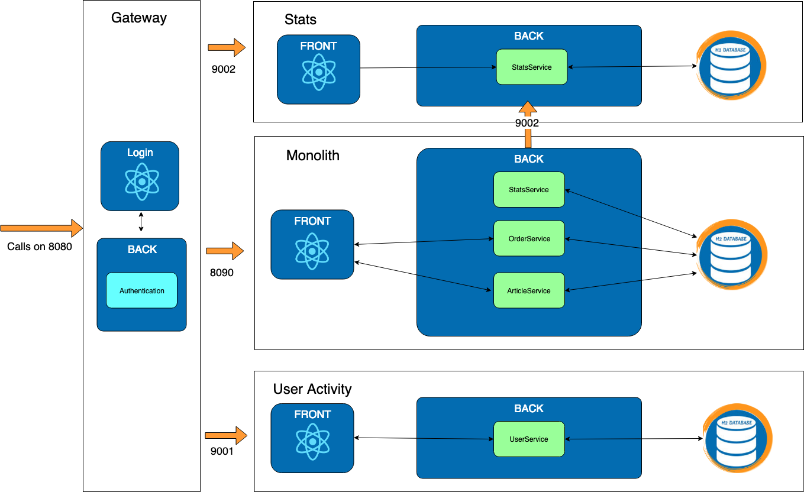

# Exercise 3 : Stats

Previously on HOMicS -> [Exercise 2: Gateway](../user-guide/gateway.md)

## Context

In real life, the stats take some time to compute and do not impact the payment workflow. We are going to extract it into
a microservice.

 What happens if the microservice is down ?

All data sent during the down time will be lost.
 
A simple way to fix this issue is to work with acknowledgment. Let's implement it.

## Goal

The monolith will save all the stats in a new table. These stats will be hosted on a new microservice called **stats**.
A scheduled task fetches this table and sends its content to the microservice. 

In case of micro-service downtime or errors while processing, the stats will be sent again at the next iteration.

 We implemented the stats microservice. You don't need to work on it in this exercise.

In terms of architecture:



## At your keyboard 

Checkout the branch

    git checkout exercise-3

Start the gateway and the two services stats and user-activity:

    # gateway
    mvn spring-boot:run -pl gateway
    # stats
    mvn spring-boot:run -pl stats
    # user-activity
    mvn spring-boot:run -pl user-activity

### 3 - Monolith

#### _TODO_ 3.1: StatsService
    
You need to save an `orderPayMessage` in the database.

------

#### _TODO_ 3.2: StatsTask

Every 10 seconds, the statsService should send the stats. You can use the following annotation:
        
    @Scheduled(fixedRate = 10000)
    
 For more information, visit this [link](https://docs.spring.io/spring/docs/current/javadoc-api/org/springframework/scheduling/annotation/Scheduled.html).

------

#### _TODO_ 3.3: StatsService

The last implementation on your part is to complete the two methods `sendStats` and `sendStat`.

The `sendStats()` fetches all orderStats in database, then sends them to the microservice using the `restTemplate`.
You already used `restTemplate` in exercise 1. If you are lost, check it out again.

This request will be a _POST_ action on the API : `http://localhost:9002/stats/api/orders`

For the payload, use the class OrderPayedDto.

A response status `HttpStatus.OK` means the microservice received the information. Then, we remove it from the
database.

------

#### _TODO_ 3.4: Clean

Remove the code related to stats that is not required anymore in the monolith.

## List of _TODOs_

3.1 - file com.homics.monolith.service.StatsService

3.2 - file com.homics.monolith.task.StatsTask

3.3 - file com.homics.monolith.service.StatsService

3.4 - 

* file com.homics.monolith.service.OrderService
* file com.homics.monolith.controller.dto.OrderStatsDto

## Database

You can access the database console via the following [url](http://localhost:9002/console).

## Verification and results

To verify that **stats** is well implemented, launch the gateway, and the monolith applications:

```bash
# Run gateway project
mvn spring-boot:run -pl gateway

# Run monolith project
mvn spring-boot:run -pl monolith
```

Login to the application on the [login page](http://localhost:8080/login). Create two carts and pay for them.

You see a 404 page on the _Stats Micro_ tab. The **stats** microservice isn't up and running at that point. This behaviour
makes sense.

Now, start the microservice **Stats**:

````bash
# Run stats project
mvn spring-boot:run -pl stats
````

Navigate to the _Stats Micro_ tab. You should see the same page than before with the stats from the previous two orders.
All the stats should be retrieved. If you don't see them, refresh few times to let the monolith discuss with the microservice 


Great. It works like a charm.

But let's see an other way of doing this.

## What's next ? [Exercise 4: Stats with Kafka](../user-guide/kafka.md)
