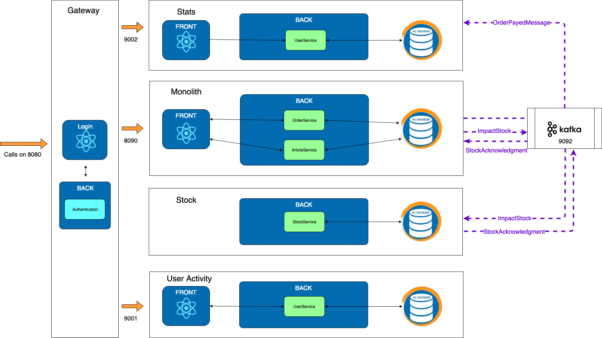

# Exercise 5 : Stock

Previously on HOMicS -> [Exercise 4: Stats with Kafka](kafka.md)

## Context

Often when splitting microservice, the question of transactions arises.
Let's try to discover why through the extraction of the **stock** microservice.

### About the stock micro-service

Stock modifications are often spread around a marketplace application. It could be modified from cart, refunds, or inventory.
The stock microservice will store and update the stock for each article. 

### The existing

Before the migration when we pay an order, we were executing the following steps:

* Open transaction

* Check the stock

* Impact the stock

* Update the order status

* Close the transaction

### Extract it into a microservice

If we extract the stock service in a microservice like we did before, the steps become :

* Open transaction

* Ask the micro service to impact the stock

* Wait for the response

* Update the order status

* Close the transaction

With this plan, you can see in step 3 that the monolith is waiting for the microservice response.

 It's pretty bad! 

Imagine that the call to impact stock times out... 

Your payment method is going to wait the whole time and so is your user.

 We need to change to asynchronous.

### Going async

* Open transaction

* Ask the micro service to impact the stock

* Close the transaction

Then, we listen to the microservice event.

* The microservice call the monolith when the stock is impacted

* Open transaction

* Update the order status

* Close the transaction

 What happens if the result of the microservice is "not enough stock" ?

We save the order as cancelled.

## Goal 

Extract the stock micro service using kafka.

The workflow becomes:

* An ImpactStockMessage is send to kafka
 
* The stock micro-service verifies and then impacts the article stock

* A StockAcknowledgmentMessage is send with a status succeed or not

* The monolith consumes the message and change the order status accordingly

## At your keyboard

Checkout the branch: 
        
    git checkout exercise-5

This exercise is split in three parts.

1. You will edit the **Monolith** to remove the stock and send a message when paying the order to decrease the stock.

2. You will consume the messages in the **Stock** microservice to decrease the stock and answer with a new message for
acknowledgement.

3. Go back to the **Monolith** and consume the answer from **Stock** and perform the stats if success.

### 5.1 - Monolith

**[todo 1]** - Remove the stock column in the Article entity.

**[todo 2]** - Remove the stock validation and call the StockService.

**[todo 3]** - Implement the method to send a kafka message to the **Stock** microservice

**Checklist** 
1. Verify that you sent a kafka message

    You can verify the creation of your message by creating a consumer via command line on your docker. To do so, you need
    to run the following command:

        docker exec $(docker ps | awk '$2 == "wurstmeister/kafka:1.0.0"' | awk '{print $1}') kafka-console-consumer.sh --bootstrap-server localhost:9092 --topic STOCK --from-beginning

    You should see the message you sent to the stock microservice.  

### 5.2 - Stock

**[todo 4]** - Consume the message and call the stock service.

**[todo 5]** - Verify that the operation wasn't already process to keep an idempotent process.

**[todo 6]** - Notify by calling the right method to acknowledge the changes on stock.

**[todo 7]** - Notify by sending a message to kafka that stock could NOT be modified.

**[todo 8]** - Save the operation as processed so it won't be process several times.

**[todo 9]** - Notify by sending a message to kafka that stock was modified successfully.

**Checklist** 
1. Verify that you sent a kafka message

    You can verify the creation of your messages by creating a consumer via command line on your docker. To do so, you need
    to run the following command:

        docker exec $(docker ps | awk '$2 == "wurstmeister/kafka:1.0.0"' | awk '{print $1}') kafka-console-consumer.sh --bootstrap-server localhost:9092 --topic STOCK --from-beginning

    You should see the messages you sent for acknowledgement and stock's modification. 

### 5.3 - Monolith

**[todo 10]** - Depending on the message sent by **Stock** for acknowledgement, set the status for the order (_PAYED_
or _CANCEL_)

**[todo 11]** - In case of success, update the stats and notify the stats microservice.

## List of _TODOs_

| **Todo** | **File(s)**                           |
|----------|---------------------------------------|
| 1 | com.homics.monolith.model.Article              |
| 2 | com.homics.monolith.service.OrderService       |
| 3 | com.homics.monolith.service.StockService |
| 4 | com.homics.stock.service.ImpactStockConsumer |
| 5 | com.homics.stock.service.StockService |
| 6 | com.homics.stock.service.StockService |
| 7 | com.homics.stock.service.StockService |
| 8 | com.homics.stock.service.StockService |
| 9 | com.homics.stock.service.StockAcknowledgmentProducer |
| 10 | com.homics.stock.service.OrderService |
| 11 | com.homics.monolith.service.OrderService |

## Good to know

When working with kafka, we can set the configuration to have either:

1. All messages received but with possible duplicates.

2. No duplicate but you can miss some messages.

We are working with the first choice. It constrains us to have idempotent messages.

 Idempotent means that an action always gives the same result even if you played several times.

In our case, the same message can be read multiple times and will give the same result. For example, in the stats microservice,
the second message only updates the data since the orderId is unique.

It explains why we keep the `table StockOperation`.

## What's next ? [Exercise 6: Containers](containers.md)

Let's deploy our market place in containers.
