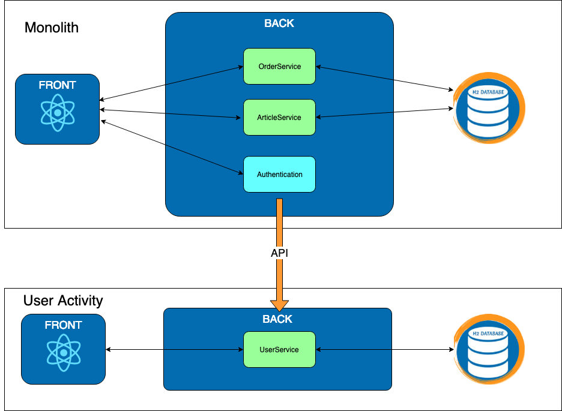
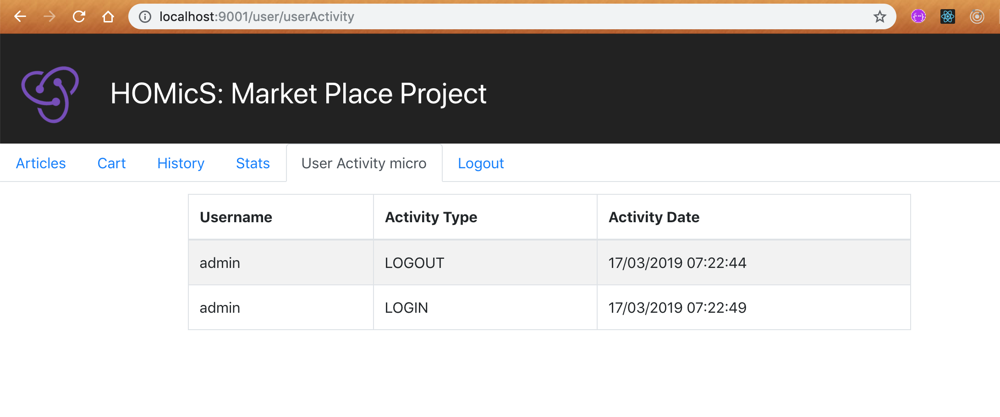

# Exercise 1 : User Activity

Previously on HOMicS -> [Exercise 0: Monolith](../user-guide/monolith.md)

## Context

In our application, we track user activity on log in and log out. This functionality is already implemented in the 
monolith codebase. 

In `WebSecurityConfig`, you can find two classes `CustomAuthenticationSuccessHandler` and 
`CustomLogoutSuccessHandler`. Those classes implement some **Spring Security** interfaces to define a strategy used to 
handle a successful user authentication or logout. In our case, they call the `UserActivityService` which save the event
in database through it `UserActivityRepository`.

>  you can read more about spring security `AuthenticationSuccessHandler` documentation
[here](https://docs.spring.io/spring-security/site/docs/4.2.11.RELEASE/apidocs/org/springframework/security/web/authentication/AuthenticationSuccessHandler.html) 

The front fetches those events for display through an internal API in `UserActivityInternalController`.

## Goal

We are going to create a new service in charge of user activities. Let's be inventive and call it: user-activity.
It will store every user activities in its own database and display the information on a dedicated page. The monolith
will call this micro-service via API to notify on a success login or success logout.



## At your keyboard

### 1.1 - User microservice:

1. Checkout the branch: 
        
        git checkout exercise-1
        
    There is a new folder for the user-activity microservice. You are not going to start from scratch but you will need
    to implement some of the API.
        
2. In your favorite IDE, open the file `UserActivityApiController` to complete the first _TODO_
    
    You need to register any activity send via the new API `/user/api/activity`.
    
    >  You will need to use `@PostMapping` with `@RequestBody` to extract the right DTO.
    
    >  The `@RequestMapping` already specified the `/user/api`

3. Run the user-activity project via the following command to access the microservice via [localhost:8080/user/userActivity](http://localhost:8080/user/userActivity):

        mvn spring-boot:run -pl user-activity

    You should see your microservice up. The **User Activity micro** tab works but any other tabs return a 404. It's logic
    since the monolith is the one providing those pages but it isn't up.
        
4. Call the api via the following command to set an activity:

        curl -d '{"username":"Jean Bonbeurre", "activityType":"LOGIN", "activityDate":"2019-04-18T15:00:00.000Z"}' -H "content-type: application/json" -X POST http://localhost:8080/user/api/activity
        
5. Check on the [localhost:8080/user/userActivity](http://localhost:8080/user/userActivity) that you can see the new activity that you just sent.
        
6. Start the monolith:

        mvn spring-boot:run -pl monolith
    
    >  You realize that you have the following error :
    
        2019-03-31 18:20:56.600 ERROR 10837 --- [  restartedMain] o.s.b.d.LoggingFailureAnalysisReporter   : 
        
        ***************************
        APPLICATION FAILED TO START
        ***************************
        
        Description:
        
        The Tomcat connector configured to listen on port 8080 failed to start. The port may already be in use or the connector may be misconfigured.
        
        Action:
        
        Verify the connector's configuration, identify and stop any process that's listening on port 8080, or configure this application to listen on another port.
    
    Since the two services are started on the same port, it makes sense. Let's change the port for user-activity
    
    Open the file application.yaml and complete the TODO 1.1.4 to change the server port to 9001
    
    Restart your app and everything is in order except that login and logout from the monolith doesn't add anything to
    your microservice. Oo 
    
    >  How does the monolith discuss with the User microservice?

# 1.2 - Connect the monolith:

1. Complete the first _TODO_ by editing the `post()` method to execute a **restTemplate** call.

2. Change the two methods called by the monolith to send the data. 

3. Clean monolith:

    As a final step, you will clean the monolith to remove any code related to the user activity.
    >  We took care of the front for you.
    
    Follow the 1.2.3 _TODO_.
    
Great, you just created your first microservice and connected it to your monolith. Not too bad.

## Database

You can access the database console via the following [url](http://localhost:9001/console).

## Verification

To verify that user-activity is well implemented, launch both applications:

```bash
# Run monolith project
mvn spring-boot:run -pl monolith

# Run user-activity project
mvn spring-boot:run -pl user-activity
```

Access and login to the [monolith](http://localhost:8080/mono/login). Navigate to the _User Activity Micro_ tab and you
should see the same table than before.



## What's next ? [Exercise 2: Gateway](../user-guide/gateway.md)
